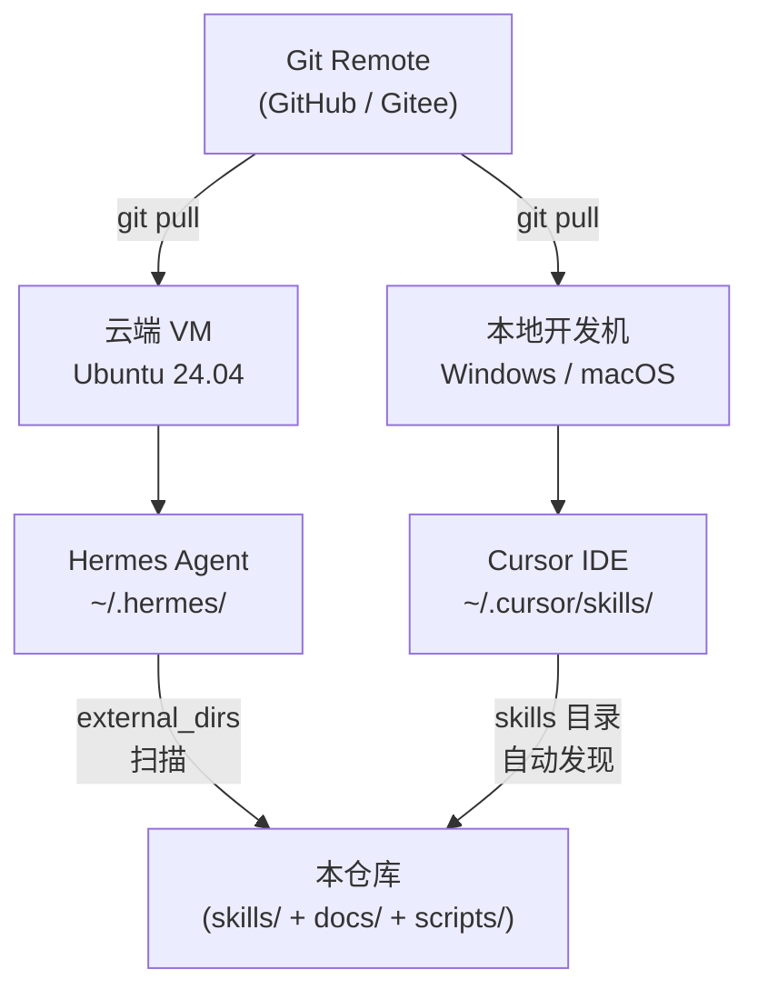

# 部署指南

本仓库同时支持接入 **Hermes Agent**(云端)和 **Cursor**(本地),同一份 `skills/` 目录两端共用。

## 架构总览



两种接入方式的区别:

| | Hermes external_dirs | Cursor skills 目录 |
|---|---|---|
| 配置位置 | `~/.hermes/config.yaml` | `~/.cursor/skills/` 或项目 `.cursor/skills/` |
| 同步方式 | 直接指向仓库 `skills/` 目录 | Junction(Windows)/ Symlink(Unix)/ 项目内目录 |
| 更新生效 | `hermes skills reload` | 重启 Cursor 或重开窗口 |

## 一、接入 Hermes(云端 VM)

### 前置条件

- Ubuntu 24.04 VM,Hermes Agent 已安装并运行
- Git 已配置(SSH key 或 PAT)

### 步骤 1:Clone 仓库

```bash
mkdir -p ~/projects
cd ~/projects
git clone <your-remote-url> ai-skills
cd ai-skills
```

### 步骤 2:配置 external_dirs

编辑 `~/.hermes/config.yaml`,在 `skills` 段加入 `external_dirs`:

```yaml
skills:
  external_dirs:
    - ~/projects/ai-skills/skills
```

如果 `skills` 段已存在其他配置,只追加 `external_dirs` 这一项,不要覆盖。

支持 `~` 展开和环境变量,例如:

```yaml
skills:
  external_dirs:
    - ${HOME}/projects/ai-skills/skills
```

### 步骤 3:重载 Hermes

```bash
# 方式 A:不重启服务,只重载 skills 索引
hermes skills reload

# 方式 B:重启整个 Hermes 服务(systemd 部署)
systemctl --user restart hermes
```

### 步骤 4:验证

```bash
# 列出所有 skills,应该看到 hello-world
hermes chat --toolsets skills -q "What skills do you have?"

# 或直接用 slash command
hermes chat -q "/hello-world"
```

预期响应包含:`Hello, friend! This skill is loaded from the shared repo.`

### 步骤 5:后续更新

```bash
cd ~/projects/ai-skills
git pull
hermes skills reload
```

### 排错

| 症状 | 原因 | 修复 |
|---|---|---|
| `/hello-world` 不存在 | external_dirs 路径写错 / 仓库没 clone | 检查 `hermes skills list --source external` |
| SKILL.md 解析失败 | frontmatter YAML 语法错 | 跑 `python scripts/validate-skills.py` |
| 修改后没生效 | 没重载 | `hermes skills reload` |
| 权限错误 | Hermes 进程用户对仓库无读权限 | `chmod -R +r ~/projects/ai-skills/skills` |

## 二、接入 Cursor(本地)

### 方案 A:项目级(推荐)

把仓库 clone 到任意位置,用 Cursor 打开这个仓库目录即可。Cursor 会自动发现 `.cursor/skills/` 下的 skill。

由于本仓库的 skill 实际放在 `skills/`(而非 `.cursor/skills/`),需要建一个 junction/symlink 把它桥接过去:

**Windows(管理员 PowerShell):**

```powershell
cd "D:\path\to\ai-skills"
New-Item -ItemType Junction -Path ".cursor\skills" -Target "$PWD\skills"
```

**macOS / Linux:**

```bash
cd /path/to/ai-skills
mkdir -p .cursor
ln -s ../skills .cursor/skills
```

然后 Cursor 打开此仓库窗口,skill 自动加载。

**优点**:跟着仓库走,团队成员 clone 后即可用(他们也需要建同样的 junction)。
**缺点**:需要在每个 clone 的地方都建一次 junction。

### 方案 B:用户级

把整个 `skills/` 目录 junction 到 `~/.cursor/skills/`,所有 Cursor 窗口都能用:

**Windows(管理员 PowerShell):**

```powershell
# 如果 ~/.cursor/skills 已存在,先删掉或改名
New-Item -ItemType Junction -Path "$env:USERPROFILE\.cursor\skills" -Target "D:\path\to\ai-skills\skills"
```

**macOS / Linux:**

```bash
ln -s /path/to/ai-skills/skills ~/.cursor/skills
```

**优点**:一次配置,全局生效。
**缺点**:如果本地有别的个人 skill,会冲突;建议这个仓库的 skills 单独放一个目录,用户级用文件级 junction 而不是目录级。

### 验证

在 Cursor 里按 `Ctrl+Shift+P` → 搜 "Skill",应该能在列表里看到 `hello-world`。或在对话框输入 `/`,看下拉里有没有 `hello-world`。

## 三、Git 远程仓库初始化

本仓库本地已 `git init` 过。接到远程的步骤:

### 1. 在 GitHub / Gitee 创建空仓库

不要勾选 "Initialize with README" / ".gitignore" / "LICENSE",保持完全空仓库。

### 2. 关联并推送

```bash
cd "d:\AI cloud agent\AIcloudagent IPO"
git remote add origin <your-remote-url>
git branch -M main
git push -u origin main
```

### 3. 在云端 VM 和其他机器上 clone

```bash
git clone <your-remote-url> ~/projects/ai-skills
```

之后按上面 "接入 Hermes" 或 "接入 Cursor" 的步骤配置即可。

## 四、CI/CD(可选,未来扩展)

如果未来需要 push 后自动让云端 Hermes 重载,可以考虑:

- **GitHub Actions + SSH**:push 到 main 分支后,通过 SSH 登录云端 VM 执行 `git pull && hermes skills reload`
- **Webhook + 本地接收脚本**:Hermes 侧暴露一个 webhook 端点,push 时触发重载
- **定时 git pull**:云端 cron 每隔 N 分钟 pull 一次,有更新就 reload(最简单但延迟大)

当前阶段推荐手动 `git pull` + `hermes skills reload`,等 skill 数量上来再考虑自动化。
