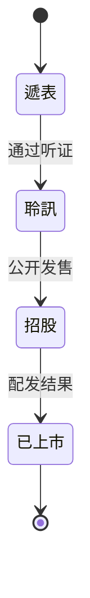

# IPO State Machine

本 skill 跟踪 4 个 IPO 生命周期状态。

## 状态定义

| 状态 | 含义 | 触发证据 |
|------|------|---------|
| 遞表 | 公司已向 HKEX 递表申请上市 | 上市申请人页面出现 |
| 聆訊 | 上市委员会已听证 | PHIP(聆讯后资料集)发布 |
| 招股 | 公司处于公开发售阶段 | 招股文件页发布全球发售文件 |
| 已上市 | 公司已完成 IPO 并挂牌 | 新上市股份配發結果公告 |

## 状态转移图



理论上状态只能向前推进,但实务中可能撤回(遞表→消失)、暂缓(聆訊后未招股)。本 skill **不主动撤回状态**,仅在 SQLite `state_history` 表追加变更记录,保留历史轨迹。

## 当前覆盖范围(第一版)

| 状态 | 数据源 URL | 第一版 |
|------|-----------|--------|
| 遞表 | `https://www1.hkexnews.hk/app/appindex.htm` | 不抓 |
| 聆訊 | (无直接公告) | 不抓 |
| **招股** | `https://www1.hkexnews.hk/search/predefineddoc.xhtml?lang=zh&predefineddocuments=6` | **抓** |
| 已上市 | `predefineddocuments=5`(新上市股份配發結果) | 不抓 |

## doc_type → state 推断规则

见 [`scripts/state.py`](../scripts/state.py) 中的 `STATE_INFER_RULES`。

```python
STATE_INFER_RULES = {
    "全球發售": "招股",
    "公開招股": "招股",
    "發售以供認購": "招股",
    "配發結果": "已上市",
    "上市申請人": "遞表",
    "聆訊後資料集": "聆訊",
    ...
}
```

**加新数据源 = 只改这一个字典**。SQLite schema、JSON 输出、文件命名都已经按 4 状态预留。

## 当前源白名单(predefineddocuments=6)

这个页面同时含有重组、介绍、债券发售等非全球发售条目。脚本只下载 `doc_type` 在以下集合内的:

```python
CURRENT_SOURCE_WHITELIST = {"全球發售", "全球发售"}
```

排除的典型条目:

| doc_type | 排除原因 |
|----------|---------|
| 重組方案 | 控股公司变更,非新股发售 |
| 介紹 | 介绍上市,无新股发售 |
| 股份發售 | GEM 板用,结构不同 |
| 招股章程 － 債務證券 | 债券,非股权 |
| 發售現有證券 | 仅现有股东出售,本 skill 不处理 |
| 發售以供認購 | 同上,需进一步判断 |

## 状态持久化

- **`companies.current_state`**:每公司最新状态
- **`state_history`**:每次状态变化追加一行(含旧状态、新状态、时间、证据)
- **JSON 输出**:`manifest.json.by_state` 是汇总统计,`company.json.state_history` 是完整时间线

## 扩展指南

加新数据源时,例如抓取「已上市」(配发结果页):

1. 在 `state.py` 的 `STATE_INFER_RULES` 加 `"配發結果": "已上市"` (已预留)
2. 写新的 `fetch_listed.py`(可复用 `fetch_ipos.py` 的下载、DB、JSON 导出函数)
3. 运行两个 fetcher,共用同一个 `data/state.db`
4. `export_json.py` 自动重算所有公司的 `current_state` 与历史

不需要改 schema、不需要改 JSON 契约、不需要改 agent 接口。
