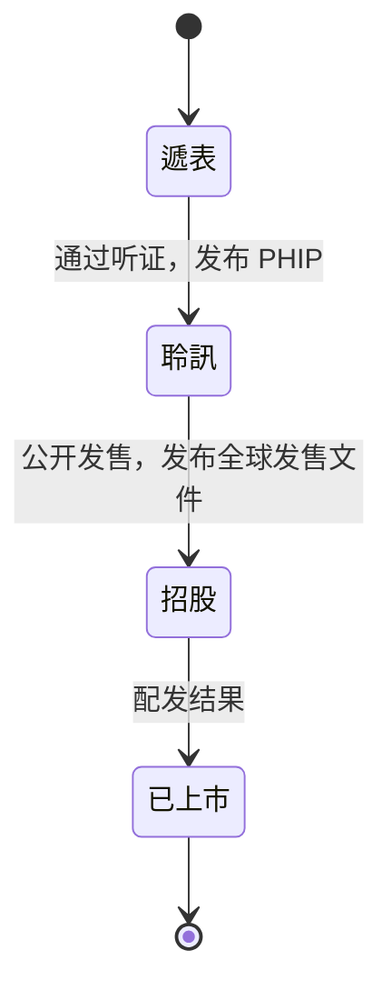
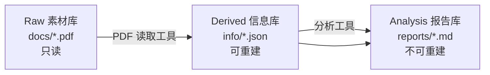

# IPO State Machine

三个 HKEX 抓取 skill（`hkex-offering-tracker` / `hkex-application-tracker` / `hkex-listing-tracker`）共同跟踪 4 个 IPO 生命周期阶段，共用 `data/state.db`；PDF 处理三件套（`hkex-pdf-reader-batch` / `hkex-pdf-reader-precision` / `hkex-pdf-field-extractor`）共用 `extractions` 表把 PDF 转成 Derived 信息库，并反向 update `companies` 表闭合 4 维状态。

## 状态定义

| 状态（listing_stage） | 含义 | 触发证据 | 由哪个 skill 填充 |
|----------------------|------|---------|------------------|
| 遞表 | 公司已向 HKEX 递表申请上市 | appindex JSON 出现 `申請版本` | `hkex-application-tracker` |
| 聆訊 | 上市委员会已听证 | appindex JSON 出现 `聆訊後資料集`（PHIP） | `hkex-application-tracker` |
| 招股 | 公司处于公开发售阶段 | 招股文件页发布全球发售文件 | `hkex-offering-tracker` |
| 已上市 | 公司已完成 IPO 并挂牌 | 新上市股份配發結果公告 | 预留（暂不抓） |

## 状态转移图



理论上状态只能向前推进，但实务中可能撤回（遞表 → 消失）、暂缓（聆訊后未招股）。本 skill **不主动撤回状态**，仅在 SQLite `state_history` 表追加变更记录，保留历史轨迹。

## 当前覆盖范围

| 状态 | 数据源 | 抓取工具 | 第一版状态 |
|------|--------|---------|----------|
| **遞表** | `ncms/json/eds/appactive_appphip_sehk_c.json`（appindex） | `hkex-application-tracker` | **已抓** |
| **聆訊** | 同上（PHIP 由同一 JSON 的 `ls[].nF` 字段标识） | `hkex-application-tracker` | **已抓** |
| **招股** | `predefineddoc.xhtml?predefineddocuments=6`（HTML） | `hkex-offering-tracker` | **已抓** |
| **已上市** | `predefineddoc.xhtml?predefineddocuments=4`（新上市股份配發結果，7 天窗口） | `hkex-listing-tracker` | **已抓**（仅已跟踪公司，双层过滤） |

## doc_type → listing_stage 推断规则

见 [`scripts/state.py`](../scripts/state.py) 中的 `STATE_INFER_RULES`。

```python
STATE_INFER_RULES = {
    # 招股源（predefineddocuments=6 HTML）
    "全球發售": "招股",
    "公開招股": "招股",
    "發售以供認購": "招股",
    # 递表源（appindex JSON `nF` 字段）
    "申請版本": "遞表",
    "申請版本（第一次呈交）": "遞表",
    "申請版本（第二次呈交）": "遞表",
    # 聆讯源（appindex JSON `nF` 字段）
    "聆訊後資料集": "聆訊",
    "聆訊後資料集（第一次呈交）": "聆訊",
    # 已上市源（predefineddocuments=4，新上市股份配發結果）
    "配發結果": "已上市",
    "配發結果公告": "已上市",
    "分配結果公告": "已上市",
    "最終發售價及配發結果公告": "已上市",
    "新上市股份配發結果": "已上市",
    # 繁简变体
    "配发结果": "已上市",
    ...
}
```

**加新数据源 = 只改这一个字典**。schema、JSON 输出、文件命名都按 4 状态预留。

## 4 维状态模型（schema v2.1）

公司状态不仅一个 `listing_stage`，而是 4 维：

| 字段 | 含义 | 默认值 | 谁填充 |
|------|------|--------|--------|
| `listing_stage` | 上市阶段（遞表/聆訊/招股/已上市） | — | 抓取工具 |
| `listing_type` | AH 类型（AH / 非-AH） | `待确认` | Skill C（`hkex-pdf-field-extractor`）从招股书抽取 |
| `listing_method` | 上市方式（创业板 / 机制A / 机制B / 18C特专科 / WVR） | 启发式推断，见下 | 抓取工具给初始值，PDF 工具可覆盖 |
| `confirmed_name` | 确认股票名称 | = `company_name`（JSON `a` 字段） | 抓取工具给初始值，PDF 工具可覆盖 |

`current_state` 字段保留为 `listing_stage` 的镜像，兼容旧 agent。

### `listing_method` 启发式规则（`infer_method_from_name()`）

由 [`common.py`](../scripts/common.py) 的 `infer_method_from_name()` 实现，基于 HKEX 公司命名规范：

| 信号 | 推断结果 | 章节 | 示例 |
|------|---------|------|------|
| 股票代码 `08*` 或 `09*` | `创业板` | — | `08001` |
| 公司名以 ` - B` 结尾 | `机制B` | Chapter 18A（未盈利生物科技） | `景澤生物醫藥 - B` |
| 公司名以 ` - P` 结尾 | `18C特专科` | Chapter 18C（特专科技） | `硅基流動 - P` |
| 公司名以 ` - W` 结尾 | `WVR` | Chapter 8A（同股不同权） | `MOMENTA GLOBAL - W` |
| 其他 | `待确认` | — | `立訊精密工業股份有限公司` |

**注意**：申请阶段公司用 `APP-{id}` 作临时 stock_code（不暴露板块信息），所以 GEM 板的识别仅适用于已分配真实股票代码的招股/已上市公司。申请阶段的 GEM 公司会被标为 `待确认`，需 PDF 工具补全。

### 渐进式填充策略

抓取工具**先填能填的，PDF 工具后续覆盖**：

| 字段 | 抓取工具填的初始值 | PDF 工具是否覆盖 |
|------|------------------|----------------|
| `listing_stage` | ✅ 完整填充 | 否（已是权威值） |
| `listing_type` | `待确认` | ✅ 必须覆盖 |
| `listing_method` | 启发式值（可能 `待确认`） | ✅ 可覆盖（更准确） |
| `confirmed_name` | = `company_name` | ✅ 可覆盖（PDF 封皮简称更短） |

## 各源下载白名单

### `predefineddocuments=6`（offering-tracker）

页面同时含有重组、介绍、债券发售等非全球发售条目。脚本只下载 `doc_type` 在以下集合内的：

```python
CURRENT_SOURCE_WHITELIST = {"全球發售", "全球发售"}
```

排除的典型条目：

| doc_type | 排除原因 |
|----------|---------|
| 重組方案 | 控股公司变更，非新股发售 |
| 介紹 | 介绍上市，无新股发售 |
| 股份發售 | GEM 板用，结构不同 |
| 招股章程 － 債務證券 | 债券，非股权 |
| 發售現有證券 | 仅现有股东出售，本工具不处理 |
| 發售以供認購 | 同上，需进一步判断 |

### `appindex JSON`（application-tracker）

JSON 的 `ls[]` 含多种文档类型，脚本只下载 `doc_type`（即 `nF` 字段）在以下集合内的：

```python
APPLICATION_SOURCE_WHITELIST = {
    "申請版本", "申請版本（第一次呈交）", "申請版本（第二次呈交）", "申請版本（第三次呈交）", "申请版本",
    "聆訊後資料集", "聆訊後資料集（第一次呈交）", "聆訊後資料集（第二次呈交）",
    "聆讯后资料集", "聆訊后资料集",
}
```

排除的典型条目：

| ls[].nS1 / nF | 排除原因 |
|---------------|---------|
| 整體協調人公告－委任 / －委任（經修訂） / －退任 | 整体协调人变动公告，非 IPO 主证据 |
| （无 `nF`，仅有警告声明 URL） | 上市申请警告声明，辅助文档 |

### `predefineddocuments=4`（listing-tracker，**双层过滤**）

页面同时含有 IPO 配发结果、老公司供股/配售等多种「配发类」公告。脚本用 **Layer 1 + Layer 2 双层过滤**避免污染数据库：

**Layer 1：白名单 + 负向过滤**（`LISTING_SOURCE_WHITELIST` + `LISTING_EXCLUDED_TITLE_PATTERNS`）：

```python
LISTING_SOURCE_WHITELIST = {
    "配發結果", "配发结果",
    "配發結果公告", "配发结果公告",
    "分配結果公告", "分配结果公告",
    "最終發售價及配發結果公告", "最终发售价及配发结果公告",
    "新上市股份配發結果", "新上市股份配发结果",
}

# 标题含以下任一关键词就拒绝，即便命中白名单关键词
LISTING_EXCLUDED_TITLE_PATTERNS = ("供股", "配售", "公開發售增發")
```

排除的典型条目：

| doc_type | 排除原因 |
|----------|---------|
| 供股結果（包括補償安排） | 老公司供股（rights issue），非 IPO |
| 配售事項公告 | 老公司配售（private placement），非 IPO |
| 公開發售增發公告 | 增发，非新上市 |

**Layer 2：已跟踪公司检查**（`--include-unknown` 可关，**正常不用**）：

```sql
SELECT 1 FROM companies WHERE stock_code = ?;  -- 必须已存在
```

设计意图：本工具**只推进我们跟踪过的公司从「招股 → 已上市」**。如果一家公司从没经过递表/聆讯/招股阶段被本系统跟踪，其配发结果不会被抓（即便它是 IPO 配发结果）。这避免大量不相关公司污染数据库。

**注意**：7 天窗口限制。HKEX 该页面默认只显示最近 7 天，跨越窗口的公司会漏抓（详见 `hkex-listing-tracker/references/page-anatomy.md` 的「如何扩展时间窗口」一节，预留 JSF POST 方案，未实现）。

## 状态持久化

- **`companies.listing_stage`** + 镜像 `current_state`：每公司最新上市阶段
- **`companies.listing_type` / `listing_method` / `confirmed_name`**：3 维状态（前 1 维待 PDF 工具，后 2 维由抓取工具给初始值）
- **`state_history`**：每次阶段变化追加一行（含旧阶段、新阶段、时间、证据）
- **`applicant_id_map`**（仅 application-tracker 创建）：申请阶段 `id` → `stock_code` 的映射，便于后续合并
- **JSON 输出**：`manifest.json.by_stage` 是汇总统计，`company.json.state_history` 是完整时间线

## 三库架构（v2.3）

公司库分为三层存储，**可重建性、修改频率、可信度**都不同，因此分离：



| 库 | 物理位置 | DB 索引表 | 谁写入 | 可重建？ |
|---|---|---|---|---|
| **Raw 素材库** | `companies/<code>_<name>/docs/*.pdf` | `ipo_documents` | 抓取工具（已有） | ✅ 重跑 fetcher |
| **Derived 信息库** | `companies/<code>_<name>/info/*.json`、`info/*.md`、`info/precision/*.md` | `extractions` | PDF 处理三件套（已落地） | ✅ 重跑 PDF 工具 |
| **Analysis 报告库** | `companies/<code>_<name>/reports/*.md` | `reports` | 人工 + AI 协作 | ❌ 含主观判断 |

### PDF 处理三件套（v2.3 落地）

Derived 库由四个 skill 共同写入，按"价值分层"分工：

| Skill | 引擎 | `extractor` 值 | `field_name` 值 | 输出位置 |
|---|---|---|---|---|
| `hkex-pdf-reader-batch` (A) | MarkItDown | `markitdown_batch_v1` | `markdown_raw` | `info/<stem>.md` |
| `hkex-pdf-reader-precision` (B) | MinerU pipeline | `mineru_pipeline_v1` | `markdown_precision` | `info/precision/<stem>.md` |
| `hkex-pdf-field-extractor` (C) | LLM | `pdf_field_v1` | 各字段名（如 `listing_type`） | `info/<field>.json` |
| `hkex-chapter-locator` | pypdf + LLM（可选） | `chapter_locator_v1` | `chapter_map` | `docs/_slices/<stem>_p<N>-<M>_<chapter>.pdf`（物理切片） |

`hkex-chapter-locator` 是**局部精读前置工具**：把"招股书第 X 章节"转换为"PDF 第 N-M 页"并切出子 PDF，让 Skill A/B/C 不必处理全本。三层定位策略：层 1（PDF 书签直读，最准）→ 层 2（目录 LLM 解析 + 页脚投票算偏移量）→ 层 3（手动 `--pages`）。实测库内 15 家公司 **100% 带书签**，层 1 直接覆盖。

Skill A 与 B 输出分目录存（`info/` vs `info/precision/`），不互相覆盖。Skill C 默认 `--source auto`：优先 Skill B 的精度版，回退 Skill A 的批量版；用 `--source-file` 可指定章节切片 markdown（精读场景）。

Skill C 抽取 `listing_type` / `confirmed_name` 后会**反向 UPDATE `companies` 表**，闭合 4 维状态模型。校验失败的字段写 `needs_review=true`，不污染主表。

详见 [docs/ROADMAP.md §4.4](../../../../docs/ROADMAP.md) 与各 skill 的 `SKILL.md`。

### `extractions` 表（衍生信息索引）

```sql
CREATE TABLE extractions (
    id              INTEGER PRIMARY KEY AUTOINCREMENT,
    stock_code      TEXT NOT NULL,
    source_pdf_hash TEXT,                  -- FK -> ipo_documents.url_hash
    extractor       TEXT NOT NULL,         -- 'markitdown_batch_v1' / 'mineru_pipeline_v1' / 'pdf_field_v1' / 'manual', ...
    field_name      TEXT NOT NULL,         -- 'markdown_raw' / 'markdown_precision' / 'listing_type' / ...
    output_path     TEXT NOT NULL,         -- 相对仓库根
    extracted_at    TEXT NOT NULL,
    content_sha256  TEXT,
    notes           TEXT
);
```

**Upsert 行为**：以 `(stock_code, field_name)` 为唯一键，重跑工具时覆盖旧记录（保持每个字段一份最新值）。注意：Skill A 与 B 用不同 `field_name`（`markdown_raw` vs `markdown_precision`），所以两套 Markdown 可以并存不冲突。

辅助函数：`upsert_extraction(conn, stock_code, field_name, output_path, extractor, ...)` 见 [`common.py`](../scripts/common.py)。

### `reports` 表（分析报告索引）

```sql
CREATE TABLE reports (
    id              INTEGER PRIMARY KEY AUTOINCREMENT,
    stock_code      TEXT NOT NULL,
    report_type     TEXT NOT NULL,         -- 'valuation', 'risk', ...
    title           TEXT,
    author          TEXT,                  -- 'human', 'gpt-4', ...
    version         INTEGER DEFAULT 1,
    file_path       TEXT NOT NULL,
    created_at      TEXT NOT NULL,
    updated_at      TEXT NOT NULL,
    source_extractions TEXT                 -- JSON array of extraction IDs
);
```

**Append-mostly**：每次迭代插入新版本（version=1, 2, 3...），保留历史草稿。

辅助函数：`upsert_report(conn, stock_code, report_type, file_path, created_at, ...)` 见 [`common.py`](../scripts/common.py)。

### `company.json` 三库一览

每公司的 `company.json` 现在包含 4 个并列字段，让 Agent 单点拿到全貌：

```json
{
  "documents": [...],      // Raw 库（PDF 列表）
  "extractions": [...],    // Derived 库（DB 索引的结构化字段）
  "reports": [...],        // Analysis 库（DB 索引的报告）
  "info_files": [...],     // Derived 库（文件系统扫描，未入 DB 的文件）
  "report_files": [...]    // Analysis 库（文件系统扫描，未入 DB 的文件）
}
```

`info_files` / `report_files` 是**容错扫描**：即使工具忘记注册到 DB，只要文件放在对应子目录，Agent 都能发现。

### 跨公司聚合视图（`views/`）

`export_json` 同时输出 3 个切片文件，便于 Agent 直接按维度读：

| 文件 | 维度 | 用途 |
|---|---|---|
| `data/views/by_stage.json` | listing_stage | "现在哪些公司在招股？" |
| `data/views/by_method.json` | listing_method | "所有机制B 公司有哪些？" |
| `data/views/by_type.json` | listing_type | "所有 AH 股有哪些？" |

每个文件按值分组，列出该组下所有公司的概要（含 stock_code、阶段、文档数、信息数、报告数）。

### Manifest 中的 `architecture` 字段

`manifest.json` 顶层加了 `architecture` 描述当前布局，便于 Agent 自省：

```json
{
  "schema_version": "2.2",
  "architecture": {
    "raw_store": "companies/<code>_<name>/docs/",
    "derived_store": "companies/<code>_<name>/info/",
    "analysis_store": "companies/<code>_<name>/reports/",
    "index_db": "state.db"
  },
  "by_stage": {...},
  "by_method": {...},
  "by_type": {...}
}
```

### 推荐读写流程

**写**（生产侧）：

```
HKEX → fetcher → Raw 库（docs/） → PDF 工具 → Derived 库（info/） → 分析工具 → Analysis 库（reports/）
                                                                                ↑
                                                                            人工也写
```

**读**（消费侧，漏斗式）：

1. 粗筛：读 `views/by_*.json` 或 `manifest.json.by_*` —— 毫秒级
2. 细筛：SQL 查询 `companies` 表 + 4 维状态
3. 看摘要：读 `companies/<code>/info/*.json`
4. 看分析：读 `companies/<code>/reports/*.md`
5. 看 PDF（最贵）：按 `documents[].local_path` 按需打开

**永远不要让 Agent 一上来就读 PDF** —— 靠前面的索引层层过滤。

## 主键合并（递表 → 招股）

申请阶段 HKEX JSON 不分配股份代号，application-tracker 用 `APP-{applicant_id}` 作临时主键（如 `APP-108261_立訊精密工業`）。当同一公司后续出现在招股发行数据源时，offering-tracker 会用真实的 `stock_code`（如 `02475_立訊精密`）创建新行，两者暂不自动合并。

未来可由独立工具按公司名匹配，把 `APP-{id}` 行的 `state_history` 合并到真实 `stock_code` 行。

## 扩展指南

加新数据源时，例如抓取「已上市」（配发结果页）：

1. 在 `state.py` 的 `STATE_INFER_RULES` 加 `"配發結果": "已上市"`（已预留）
2. 写新的 `fetch_listed.py`（可复用 `common.py` 的下载、DB、JSON 导出函数）
3. 运行新 fetcher，共用同一个 `data/state.db`
4. `export_json` 自动重算所有公司的 `listing_stage` 与历史

不需要改 schema、不需要改 JSON 契约、不需要改 agent 接口。
